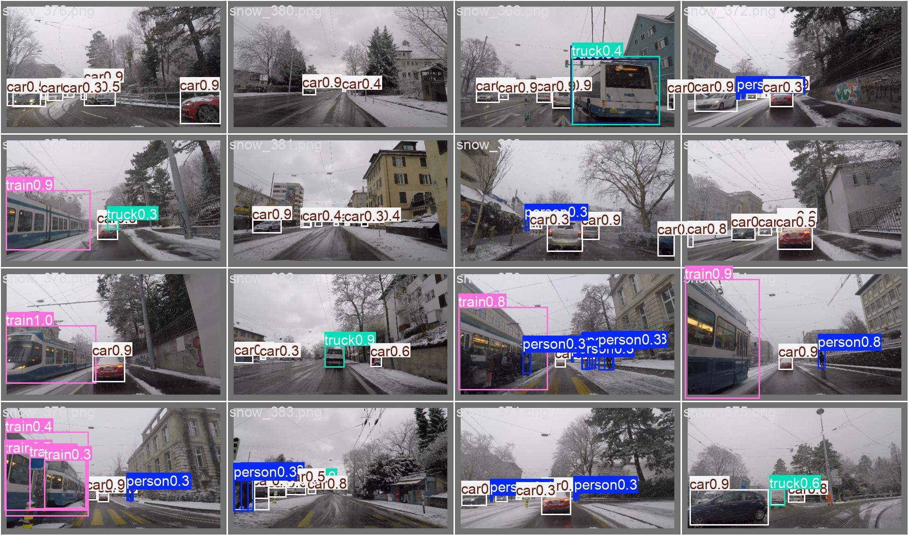

# ETH AI Object Detection

[](https://github.com/Danielit707/ETH_AI_OBJ_DETECTION/actions/workflows/ci.yml)
[](https://www.python.org/downloads/)
[](https://nextjs.org)
[](License.pdf)

Object detection for road users in adverse-weather conditions. Trains a
YOLO model on the ACDC dataset and deploys it through a FastAPI inference
service with both a desktop client and a modern Next.js web interface.



## What this project does

- **Converts** ACDC COCO-format annotations to YOLO format (all 4 weather conditions)
- **Trains** YOLO11n on ~37,000 adverse-weather road images (8 classes: person, rider, car, truck, bus, train, motorcycle, bicycle)
- **Deploys** a FastAPI inference API with Docker (CPU or GPU)
- **Provides** a Next.js web UI with visual bounding-box overlay, confidence controls, and class filtering
- **Supports** test-time augmentation (TTA) for improved accuracy

## Quick start

### Run the API

```powershell
docker compose up --build
```

- Health check: `http://localhost:8000/health`
- API docs: `http://localhost:8000/docs`

### Run the web UI

```powershell
cd web
npm install
npm run dev
```

Open `http://localhost:3000` — the UI includes real ACDC sample images for
one-click testing.

### Run the desktop client

```powershell
python -m pip install -r requirements-ui.txt
python main.py
```

## Project structure

```
api/                  FastAPI inference service
  main.py             /health and /predict endpoints
  inference.py        Lazy-loading, thread-safe model wrapper
  tta.py              Test-time augmentation (multi-scale + flip)
dataset/              ACDC conversion and training scripts
  convert_coco_to_yolo.py
  yolo_train.py
  run_conversion.py
docs/                 Project documentation
images/               Example predictions and visualizations
models/               Trained checkpoints (local, gitignored)
  acdc-yolov8n-best.pt   Baseline YOLOv8n (mAP@0.5 = 0.2664)
  acdc-yolov11n-best.pt  Improved YOLO11n (mAP@0.5 = 0.2906)
notebooks/            Colab training notebooks
reports/              Training metrics and evaluation results
scripts/              Evaluation and comparison tools
tests/                pytest test suite
web/                  Next.js web interface
main.py               CustomTkinter desktop client
compose.yaml          Docker Compose configuration
Dockerfile            CPU-only inference container
```

## Model performance

| Model | mAP@0.5 | mAP@0.5:0.95 | Precision | Recall |
|---|---|---|---|---|
| YOLOv8n (baseline) | 0.2664 | 0.1538 | 0.5737 | 0.2561 |
| YOLO11n (improved) | 0.2906 | 0.1611 | 0.4701 | 0.2998 |

Both models are trained on the full ACDC dataset (fog, night, rain, snow) at
512px resolution. The YOLO11n checkpoint was trained for 50 epochs with AdamW,
cosine LR, mixup, and copy-paste augmentation.

## Training

### With Google Colab (recommended)

Open [`notebooks/train_acdc_yolov11n_colab.ipynb`](notebooks/train_acdc_yolov11n_colab.ipynb)
in Colab with a T4 GPU runtime. Training takes ~1 hour and produces a
checkpoint with ~3 point mAP improvement over the baseline.

### Local training

```powershell
python dataset/run_conversion.py --acdc-root "D:\datasets\ACDC"
python dataset/yolo_train.py --model yolo11n.pt --epochs 50 --imgsz 512 --batch 32
```

### Evaluate

```powershell
python scripts/evaluate_model.py --model models/acdc-yolov11n-best.pt --data dataset/processed/data.yaml
```

## API usage

```powershell
curl.exe -X POST "http://localhost:8000/predict?confidence=0.05&image_size=512" `
  -F "image=@D:\path\to\scene.png"
```

| Parameter | Default | Description |
|---|---|---|
| `confidence` | 0.05 | Confidence threshold (0-1) |
| `image_size` | 512 | Inference resolution (32-1280) |
| `use_tta` | false | Enable test-time augmentation |

## Testing

```powershell
python -m pip install -r requirements-test.txt
python -m pytest -q
```

30 tests covering the API, inference service, dataset conversion, and UI.

## License

The ACDC dataset and trained model weights are subject to the
[ACDC License](License.pdf) (non-commercial use). The source code is provided
for research and educational purposes.
